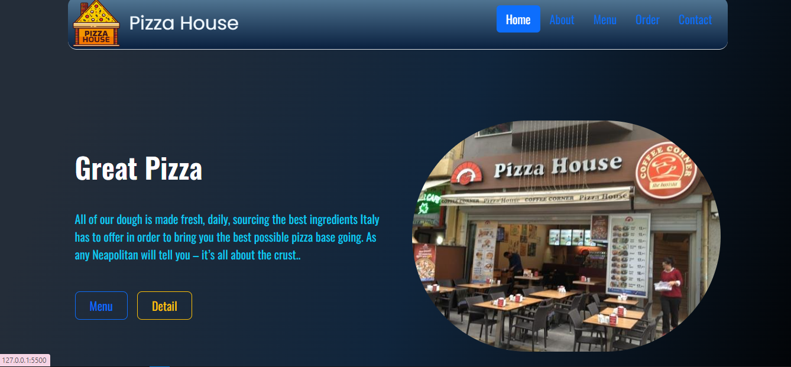

# JS-Project-- Restaurant Menu With Json Api

##JS eğitiminde hazırlanmış projedir.

# "Restaurant Menu" html-css-boostrap-JS ve Json API yapı ile oluşturulmuştur.

- Bu proje dinamik kategori ile filtreleme işlevi yaparak menuleri kategorilere ayırır.,
- Her kategor içeriği yrı ve tüm menu olarak görüntülenebilir.
- Seçilen ürün ayrı html yapıda daha detaylı içerikle görüntülenir.
- Menu ve detail butonları dinamik yapıdadır.
- Detail html sayfasında ürün img üzerinden diğer menu detaylarına erişim vardır.

### udemig ödev çalışmasıdır...

### HTML, CSS ve JavaScript temelli ve Json api yapı  kullanarak bir proje yapıldı.

# JS-Restaurant Menu

# Restaurant_menu
# Restaurant_menu
